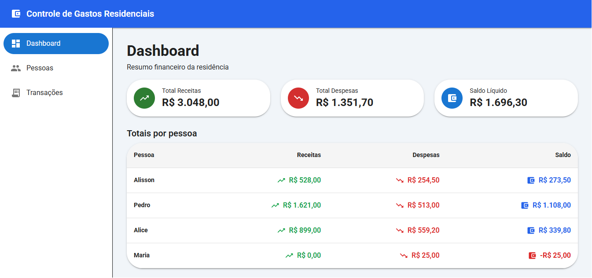
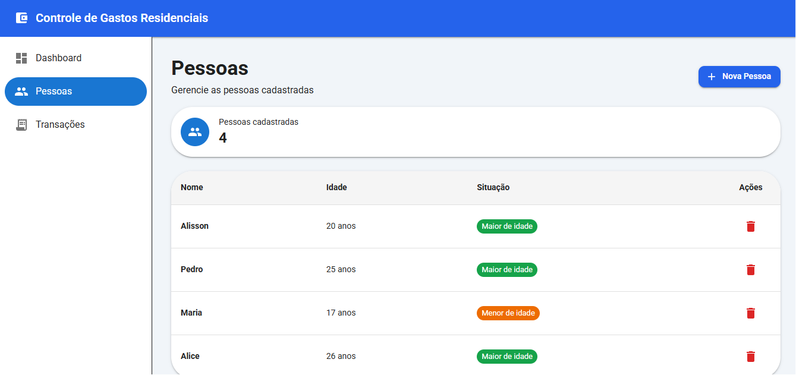
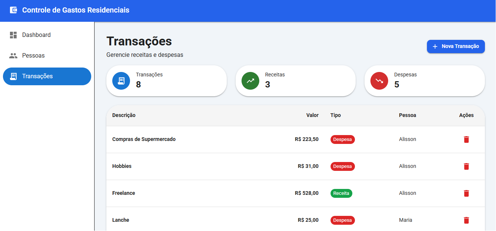
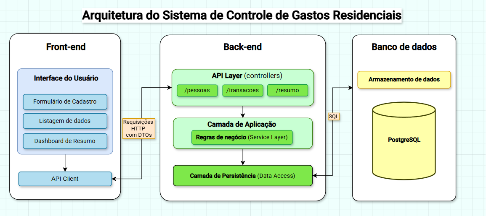
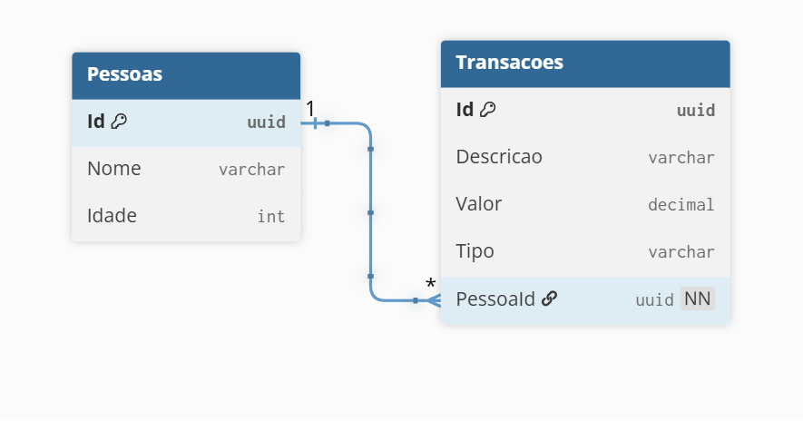
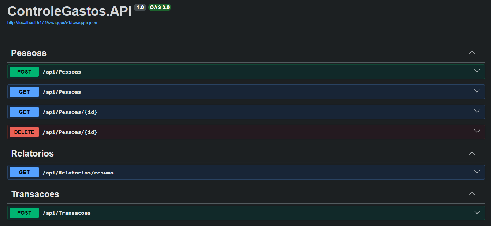

# Sistema de Controle de Gastos Residenciais

Projeto desenvolvido como solução para um desafio técnico utilizando **.NET**, **ASP.NET Core Web API**, **React** e **TypeScript**.

O sistema permite o gerenciamento de pessoas, transações financeiras e a visualização de um dashboard com o resumo financeiro, seguindo as regras de negócio propostas.

---

# Imagens da aplicação

## Dashboard

<p align="center">
    
</p>


## Gerenciamento de pessoas

<p align="center">
    
</p>


## Gerenciamento de transações

<p align="center">
    
</p>

---

# Checklist de requisitos

## Objetivo

✅ Sistema de controle de gastos residenciais desenvolvido com:

- [x] Cadastro de pessoas;
- [x] Cadastro de transações financeiras;
- [x] Consulta de totais e resumo financeiro;
- [x] Persistência dos dados após reiniciar a aplicação;
- [x] Código documentado com comentários explicando responsabilidades e regras de negócio.


---

# Requisitos funcionais


## Cadastro de pessoas

- [x] Criar pessoa;
- [x] Listar pessoas;
- [x] Buscar pessoa por identificador;
- [x] Remover pessoa;


### Dados cadastrados

- [x] Identificador único gerado automaticamente;
- [x] Nome;
- [x] Idade;


### Regras

- [x] Ao remover uma pessoa, todas as suas transações relacionadas são removidas automaticamente.


---


## Cadastro de transações

- [x] Criar transação;
- [x] Listar transações;
- [x] Buscar transação por identificador;
- [x] Remover transação; (funcionalidade adicional).


### Dados cadastrados

- [x] Identificador único gerado automaticamente;
- [x] Descrição;
- [x] Valor;
- [x] Tipo (Despesa ou Receita);
- [x] Pessoa vinculada através do identificador;


### Regras

- [x] A pessoa informada deve existir no cadastro de pessoas;
- [x] Pessoas menores de 18 anos podem cadastrar apenas despesas.


---


## Consulta de totais

- [x] Listagem dos totais financeiros por pessoa;
- [x] Total de receitas por pessoa;
- [x] Total de despesas por pessoa;
- [x] Saldo individual (receitas - despesas);
- [x] Total geral de receitas;
- [x] Total geral de despesas;
- [x] Saldo líquido geral.


---


# Tecnologias obrigatórias

## Backend

- [x] .NET 10;
- [x] C#;


## Frontend

- [x] React;
- [x] TypeScript.


---

# Tecnologias utilizadas

## Backend

- .NET 10
- ASP.NET Core Web API
- C#
- Entity Framework Core
- PostgreSQL
- Swagger

## Frontend

- React
- TypeScript
- Material UI
- Tailwind CSS
- Axios

## Ferramentas

- Docker Compose
- Git

---

# Arquitetura

O backend foi desenvolvido seguindo uma arquitetura em camadas, separando responsabilidades entre Controllers, Services, DTOs e acesso aos dados utilizando Entity Framework Core.

O frontend foi organizado por páginas, componentes reutilizáveis, serviços de comunicação com a API e tipagens, facilitando a manutenção e evolução da aplicação.

---

## Diagrama de Arquitetura

<p align="center">
    
</p>

---

## Diagrama de Entidade-Relacionamento

<p align="center">
    
</p>

---


# Funcionalidades

## Dashboard

- Resumo geral
- Total de receitas
- Total de despesas
- Saldo líquido
- Totais por pessoa

---

## Cadastro de pessoas

- Criar pessoa
- Listar pessoas
- Buscar pessoa por ID
- Remover pessoa

Ao remover uma pessoa, todas as suas transações também são removidas automaticamente.

---

## Cadastro de transações

- Criar transação
- Listar transações
- Buscar transação por ID
- Remover transação

### Regras de negócio

- A pessoa informada deve existir.
- Pessoas menores de 18 anos podem cadastrar apenas despesas.

---

## Relatórios

Consulta contendo:

- Total de receitas por pessoa;
- Total de despesas por pessoa;
- Saldo por pessoa;
- Total geral de receitas;
- Total geral de despesas;
- Saldo geral.

---

# Estrutura do projeto

```text
ControleGastos
│
├── backend
│   └── ControleGastos.API
│       ├── Controllers
│       ├── Data
│       ├── DTOs
│       │   ├── Pessoas
│       │   ├── Relatorios
│       │   └── Transacoes
│       ├── Enums
│       ├── Exceptions
│       ├── Models
│       ├── Services
│       │   └── Interfaces
│       ├── Migrations
│       └── Program.cs
│
├── frontend
│   ├── src
│   │   ├── api
│   │   ├── components
│   │   ├── pages
│   │   ├── routes
│   │   ├── types
│   │   └── utils
│   └── package.json
│
└── docker-compose.yml
```

---

# Pré-requisitos

- .NET SDK 10
- Node.js 22+
- Docker Desktop

---

# Como executar

## 1. Clone o repositório

```bash
git clone https://github.com/alissontfraga/ControleGastos.git
```

---

## 2. Acesse a pasta do projeto

```bash
cd ControleGastos
cd Backend
```

## 3. Crie um arquivo .env dentro da pasta Backend: 

```
POSTGRES_DB=controlegastos
POSTGRES_USER=postgres
POSTGRES_PASSWORD=postgres
```


---

## 4. Inicie o banco de dados

```bash
docker compose up -d
```

---

## 5. Execute as migrations

```bash
cd backend/ControleGastos.API
dotnet ef database update
```

---

## 6. Execute o backend

```bash
dotnet run
```

A API estará disponível em:

```
http://localhost:5174
```

---

## 7. Execute o frontend

Crie um arquivo .env dentro da pasta Frontend: 

```
VITE_API_URL=http://localhost:5174/api
```

Em outro terminal:

```bash
cd frontend
npm install
npm run dev
```

O frontend estará disponível em:

```
http://localhost:5173
```

---

# Swagger

Após iniciar o backend, acesse:

```
http://localhost:5174/swagger
```

> A porta e o protocolo podem variar conforme a configuração do ambiente.

<p align="center">
    
</p>

---

# Principais regras de negócio

- Pessoas menores de idade podem cadastrar apenas despesas.
- Toda transação deve estar vinculada a uma pessoa existente.
- Ao excluir uma pessoa, todas as suas transações são removidas automaticamente.
- O sistema calcula automaticamente receitas, despesas e saldo por pessoa, além dos totais gerais.

---

# Endpoints da API

## Pessoas

| Método | Endpoint | Descrição |
|--------|----------|-----------|
| GET | `/api/Pessoas` | Lista todas as pessoas cadastradas |
| GET | `/api/Pessoas/{id}` | Busca uma pessoa pelo ID |
| POST | `/api/Pessoas` | Cadastra uma nova pessoa |
| DELETE | `/api/Pessoas/{id}` | Remove uma pessoa e suas transações relacionadas |


## Transações

| Método | Endpoint | Descrição |
|--------|----------|-----------|
| GET | `/api/Transacoes` | Lista todas as transações |
| GET | `/api/Transacoes/{id}` | Busca uma transação pelo ID |
| POST | `/api/Transacoes` | Cadastra uma nova transação |
| DELETE | `/api/Transacoes/{id}` | Remove uma transação |


## Relatórios

| Método | Endpoint | Descrição |
|--------|----------|-----------|
| GET | `/api/Relatorios/resumo` | Retorna o resumo financeiro geral e por pessoa |

---

# Tratamento de erros

A API utiliza tratamento global de exceções através do `IExceptionHandler`.

Exceções implementadas:

| Exceção | Código HTTP | Descrição |
|---------|:-----------:|-----------|
| `NotFoundException` | 404 | Recurso não encontrado. |
| `BusinessException` | 400 | Violação de regra de negócio. |
| Demais exceções | 500 | Erro interno inesperado. |

---

# Comandos úteis

### Iniciar o banco

```bash
docker compose up -d
```

### Parar o banco

```bash
docker compose down
```

### Aplicar migrations

```bash
cd backend/ControleGastos.API
dotnet ef database update
```

### Executar o backend

```bash
dotnet run
```

### Executar o frontend

```bash
cd frontend
npm run dev
```

---

